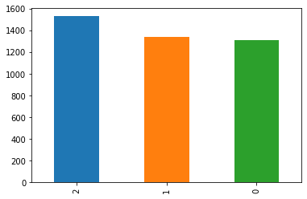
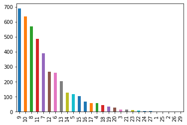
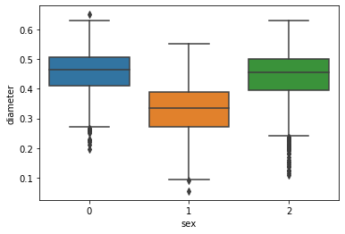
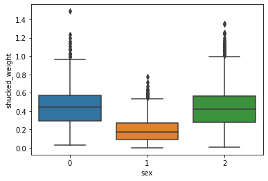
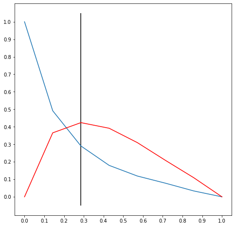
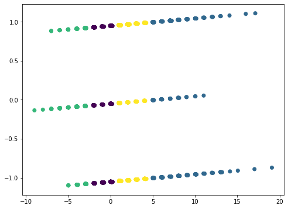
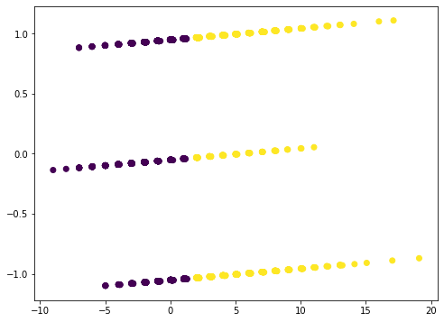
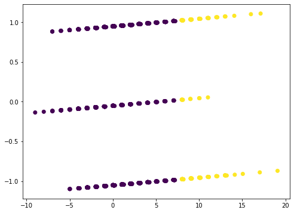

# Finding clusters of abalone
_Given a dataset containing information on abalone, can we find an optimal clustering for them?_

## Table of contents
1. [Data ingestion](#Data-ingestion)
2. [Data preprocessing](#Data-preprocessing)
3. [EDA](#EDA)
4. [Model Training](#Model-Training)
5. [Credits](#Credits)

## Data ingestion

### Introduction

Thanks to UCI Machine Learning Group for providing the dataset, which can be found [here](https://archive.ics.uci.edu/ml/datasets/Abalone).  

From the UCI MLG page, the columns are detailed as follows:  

Format: **Name** / Data Type / Measurement Unit / Description

**Sex** / nominal / -- / M, F, and I (infant)  
**Length** / continuous / mm / Longest shell measurement  
**Diameter** / continuous / mm / perpendicular to length  
**Height** / continuous / mm / with meat in shell  
**Whole weight** / continuous / grams / whole abalone  
**Shucked weight** / continuous / grams / weight of meat  
**Viscera weight** / continuous / grams / gut weight (after bleeding)  
**Shell weight** / continuous / grams / after being dried  
**Rings** / integer / -- / +1.5 gives the age in years  


### Initial thoughts

For this dataset, we will be performing a clustering operation using various clustering algorithms. We will also be automating the selection of the optimal-K value for this clustering for future use in 5411's clustering feature. Let's begin by opening the dataset and looking at what we have.

## Data preprocessing

We begin by importing the abalone dataset into our notebook and checking for null values. 


```python
# import data science packages
import numpy as np
import pandas as pd
import math
from sklearn.preprocessing import MinMaxScaler, LabelEncoder

# import k means methods
from sklearn.cluster import KMeans, SpectralClustering
from sklearn.metrics import silhouette_score

#import elbow method algorithm
from kneed import KneeLocator

df = pd.read_csv("abalone.csv")
df.head()
```


<div>
<style scoped>
    .dataframe tbody tr th:only-of-type {
        vertical-align: middle;
    }

    .dataframe tbody tr th {
        vertical-align: top;
    }

    .dataframe thead th {
        text-align: right;
    }
</style>
<table border="1" class="dataframe">
  <thead>
    <tr style="text-align: right;">
      <th></th>
      <th>sex</th>
      <th>length</th>
      <th>diameter</th>
      <th>height</th>
      <th>whole_weight</th>
      <th>shucked_weight</th>
      <th>viscera_weight</th>
      <th>shell_weight</th>
      <th>rings</th>
    </tr>
  </thead>
  <tbody>
    <tr>
      <th>0</th>
      <td>M</td>
      <td>0.455</td>
      <td>0.365</td>
      <td>0.095</td>
      <td>0.5140</td>
      <td>0.2245</td>
      <td>0.1010</td>
      <td>0.150</td>
      <td>15</td>
    </tr>
    <tr>
      <th>1</th>
      <td>M</td>
      <td>0.350</td>
      <td>0.265</td>
      <td>0.090</td>
      <td>0.2255</td>
      <td>0.0995</td>
      <td>0.0485</td>
      <td>0.070</td>
      <td>7</td>
    </tr>
    <tr>
      <th>2</th>
      <td>F</td>
      <td>0.530</td>
      <td>0.420</td>
      <td>0.135</td>
      <td>0.6770</td>
      <td>0.2565</td>
      <td>0.1415</td>
      <td>0.210</td>
      <td>9</td>
    </tr>
    <tr>
      <th>3</th>
      <td>M</td>
      <td>0.440</td>
      <td>0.365</td>
      <td>0.125</td>
      <td>0.5160</td>
      <td>0.2155</td>
      <td>0.1140</td>
      <td>0.155</td>
      <td>10</td>
    </tr>
    <tr>
      <th>4</th>
      <td>I</td>
      <td>0.330</td>
      <td>0.255</td>
      <td>0.080</td>
      <td>0.2050</td>
      <td>0.0895</td>
      <td>0.0395</td>
      <td>0.055</td>
      <td>7</td>
    </tr>
  </tbody>
</table>
</div>


```python
print("Presence of null values: " + str(df.isnull().values.any()))
```

    Presence of null values: False
    

There are no null values in our dataset, which is nice. We can now encode our categorical data to be a numerical value. This means that our 'sex' column will be 3 different numbers. 


```python
lbl = LabelEncoder()
df['sex'] = lbl.fit_transform(df['sex'])
keys = lbl.classes_
values = lbl.transform(lbl.classes_)
mapping = dict()
dictionary = dict(zip(keys, values))
print(dictionary)
```

    {'F': 0, 'I': 1, 'M': 2}
    

Now we can analyze some of our data before we begin clustering. 

## EDA

First,  let's make a correlation graph of our column values and see what has the strongest trends.


```python
import seaborn as sns 

corr = df.corr()
sns.heatmap(corr)
```


    <matplotlib.axes._subplots.AxesSubplot at 0x2b012d1d470>


Judging from the heatmap, there are a lot of correlation points between the physical attributes of the abalone. There isn't much of a correlation between the sex and the physical attributes, however. 


```python
pd.value_counts(df['sex']).plot.bar()
```


    <matplotlib.axes._subplots.AxesSubplot at 0x2b014f76940>





```python
pd.value_counts(df['rings']).plot.bar()
```


    <matplotlib.axes._subplots.AxesSubplot at 0x2b015008828>





From the above two plots, we can see that there are roughly equal distributions of M, F, and I genders. For the rings, it appears that the most common numbers of rings range from 7 to 11, while other numbers of rings are rarer in comparison. 


```python
sns.boxplot(x = 'sex', y = 'diameter', data = df)
```


    <matplotlib.axes._subplots.AxesSubplot at 0x2b01510eda0>





```python
sns.boxplot(x = 'sex', y = 'shucked_weight', data = df)
```


    <matplotlib.axes._subplots.AxesSubplot at 0x2b01519cdd8>





From the boxplots, we can see that the M, F sexes are very similar in physical size and type. Potential use cases for this information include food consumptio (e.g fishermen can prioritize M/F type abalone since they are larger). Let's try to remove some of the outliers present within the dataset so we can get a clearer picture. 


```python
males = df[df['sex'] == 2]
females = df[df['sex'] == 0]
infants = df[df['sex'] == 1]

quantile_male = males['shucked_weight'].quantile(0.90)
quantile_female = females['shucked_weight'].quantile(0.90)
quantile_infant = infants['shucked_weight'].quantile(0.90)

males[males['shucked_weight'] < quantile_male]
females[females['shucked_weight'] < quantile_female]
infants[infants['shucked_weight'] < quantile_infant]

frames = [males, females, infants]
df = pd.concat(frames)
print(len(df.index))
```

    4177
    


```python
sns.boxplot(x = 'sex', y = 'shucked_weight', data = df)
```


    <matplotlib.axes._subplots.AxesSubplot at 0x2b015224978>


Let's try building our clustering model with the abalone.

## Model Training

We will be using different clustering algorithms and analyzing their performances while running our automated K-selection code. 

### K-Means (elbow method)

We can also profile the time it takes to cluster the dataset with each algorithm with the '%time' command.


```python
# hold error value for elbow method calculation
error = []


for i in range(2, 10):
    kmeans = KMeans(n_clusters = i)
    %time kmeans.fit(df)
    error.append(kmeans.inertia_)

# find the elbow of the graph using kneed package   
optimalK = KneeLocator(
    range(2, 10),
    error,
    curve = 'convex',
    direction = 'decreasing',
    interp_method = 'interp1d',
)

# print number of clusters for dataset
print("\nNumber of clusters: " + str(optimalK.elbow))
optimalK.plot_knee_normalized()

# create optimal K graph for prediction model 
kmeans = KMeans(n_clusters = optimalK.elbow)
```

    Wall time: 72.5 ms
    Wall time: 80.1 ms
    Wall time: 109 ms
    Wall time: 159 ms
    Wall time: 143 ms
    Wall time: 165 ms
    Wall time: 191 ms
    Wall time: 251 ms
    
    Number of clusters: 4
    





We can then plot the clustering for this dataset given by KMeans.


```python
from sklearn.decomposition import PCA
import matplotlib.pyplot as plt

pca = PCA(n_components = 2)
new_df = pca.fit_transform(df)
model = KMeans(n_clusters = optimalK.elbow).fit(new_df)

plt.figure(figsize=(8, 6))
plt.scatter(new_df[:,0], new_df[:,1], c=model.labels_.astype(float))
```


    <matplotlib.collections.PathCollection at 0x2b017387e80>





### K-Means (silhouette)


```python
silhouette_vals = dict()
optimalK = 0

for i in range(2, 10):
    kmeans = KMeans(n_clusters = i)
    %time cluster_labels = kmeans.fit_predict(df)
    silhouette_vals[i] = silhouette_score(df, cluster_labels)

silhouette_optimalK = max(silhouette_vals, key=silhouette_vals.get)
print("\nNumber of clusters: " + str(silhouette_optimalK))

pca = PCA(n_components = 2)
new_df = pca.fit_transform(df)
model = KMeans(n_clusters = silhouette_optimalK).fit(new_df)

plt.figure(figsize=(8, 6))
plt.scatter(new_df[:,0], new_df[:,1], c=model.labels_.astype(float))
```

    Wall time: 96.6 ms
    Wall time: 86.9 ms
    Wall time: 107 ms
    Wall time: 150 ms
    Wall time: 152 ms
    Wall time: 203 ms
    Wall time: 201 ms
    Wall time: 242 ms
    
    Number of clusters: 2
    


    <matplotlib.collections.PathCollection at 0x2b0173f6be0>





For this dataset, it seems that the silhouette method gives the best K value for the dataset. However, we had to use PCA to visualize the data on a 2-D space, so the graph is difficult to interpret as a result. 

### Spectral Clustering (silhouette)

Below is the code given for the spectral clustering algorithm in sklearn. 


```python
# error contains error value for each value of k
optimalK = 0
silhouette_vals = dict()

# iterate through possible k values to set up optimization graph
for i in range(2, 10):
    sc = SpectralClustering(i)
    %time spectral_cluster_labels = sc.fit_predict(df)
    silhouette_vals[i] = silhouette_score(df, spectral_cluster_labels)
    
silhouette_optimalK = max(silhouette_vals, key=silhouette_vals.get)
print("\nNumber of clusters: " + str(silhouette_optimalK))
```

    Wall time: 6.23 s
    Wall time: 6.01 s
    Wall time: 5.88 s
    Wall time: 6.07 s
    Wall time: 6.12 s
    Wall time: 6.38 s
    Wall time: 6.19 s
    Wall time: 5.66 s
    
    Number of clusters: 2
    


```python
from sklearn.decomposition import PCA

pca = PCA(n_components = 2)
new_df = pca.fit_transform(df)
model = SpectralClustering(silhouette_optimalK).fit_predict(new_df)

plt.figure(figsize=(8, 6))
plt.scatter(new_df[:,0], new_df[:,1], c=model.astype(float))

```


    <matplotlib.collections.PathCollection at 0x2b0152d4588>





We can see that spectral clustering is very slow for this dataset compared to KMeans, and KMeans still gives a good clustering as seen in the PCA analysis. Therefore, it is better to use KMeans for this dataset. 

## Credits

Thanks again to the UCI Machine Learning Group for providing the dataset. 
